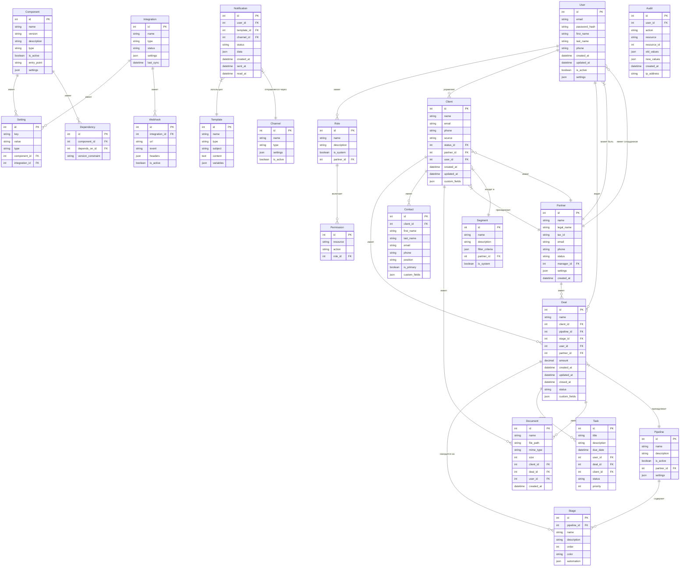

# ER-диаграмма MaK CRM

## Основные сущности

## Дополнительные связи и ограничения

1. **Каскадное удаление:**
   - При удалении клиента удаляются все его контакты, документы и сделки
   - При удалении сделки удаляются все связанные с ней задачи и документы
   - При удалении воронки удаляются все её этапы

2. **Ограничения целостности:**
   - Пользователь не может быть удален, если он является ответственным за клиентов или сделки
   - Партнер не может быть удален, если с ним связаны клиенты или сделки
   - Компонент не может быть удален, если от него зависят другие компоненты

3. **Индексы для оптимизации:**
   - Индексы по внешним ключам для ускорения JOIN-запросов
   - Индексы по полям фильтрации (status, created_at, updated_at)
   - Полнотекстовые индексы для поиска по текстовым полям

4. **Партиционирование:**
   - Таблицы с историческими данными (audit, notification) партиционируются по дате
   - Таблицы с большим объемом данных (client, deal) могут быть партиционированы по partner_id

## Расширяемость схемы

1. **JSON-поля для гибкости:**
   - custom_fields в таблицах client, contact, deal для хранения дополнительных атрибутов
   - settings в таблицах user, partner, pipeline для хранения настроек
   - filter_criteria в таблице segment для хранения критериев сегментации

2. **Миграции:**
   - Все изменения схемы выполняются через миграции
   - Миграции версионируются и применяются последовательно
   - Для каждой миграции предусмотрен откат (rollback)

## Примечания по реализации

1. **PostgreSQL:**
   - Использование JSONB для JSON-полей
   - Использование наследования таблиц для партиционирования
   - Использование материализованных представлений для аналитики

2. **Индексы:**
   - B-tree индексы для обычных полей
   - GIN индексы для JSONB-полей
   - Частичные индексы для оптимизации запросов с условиями

3. **Ограничения:**
   - CHECK-ограничения для проверки значений
   - UNIQUE-ограничения для уникальности комбинаций полей
   - FOREIGN KEY с указанием действий при удалении/обновлении
